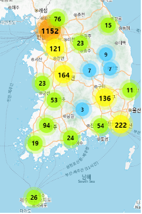

# 지역별 의료기관 현황 -> (실제 내용과 불일치)

!!! failure

    실제로는 농촌보다 도시에 우울증 유병률이 높았다는 [연구 결과](https://www.cmj.ac.kr/pdf/10.4068/cmj.2023.59.2.128)가 있으므로, 해당 근거는 적합하지 않은 것으로 판단하여 <mark style="background-color: #880000">정리를 중단</mark>하였습니다.

---

## 비ㆍ수도권 간의 격차

의료 인프라가 부족한 농촌 및 의료취약지역에서는 전문 정신건강 서비스를 접하기 어렵고, 이에 의해 상담이나 약물치료를 정기적으로 받기 힘든 실정입니다.

이로 인해, 우울증 환자의 치료를 지연시켜 증상을 악화시키고 지역사회 차원의 부담을 가중시킵니다.
결국, <mark>수도권ㆍ비수도권의 의료 인프라 차이가 우울증 환자의 확대로 이어지는 결과를 초래</mark>합니다.

## 

## 영월의 지역적 특성

---
