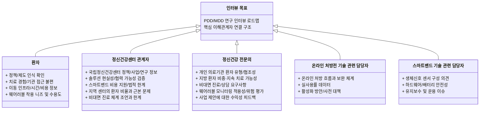

# 이해관계자 분석

---

아래 클래스 다이어그램은 연구 목표 달성을 위해 인터뷰해야 할 핵심 이해관계자와 각 인터뷰에서 확보할 수 있는 주요 인사이트를 관계 중심으로 정리한 것이다.

```mermaid
classDiagram

  class InterviewTargets["인터뷰 목표"] {
    PDD/MDD 연구 인터뷰 로드맵
    핵심 이해관계자 연결 구조
  }

  InterviewTargets <|-- Patient
  InterviewTargets <|-- MentalHealthCenter
  InterviewTargets <|-- Psychiatrist
  InterviewTargets <|-- EPrescription
  InterviewTargets <|-- SmartbandEngineer

  class Patient["환자"] {
    + 정책/제도 인식 확인
    + 치료 경험/기관 접근 불편
    + 이동 인프라/시간/비용 정보
    + 웨어러블 착용 니즈 및 수용도
  }

  class MentalHealthCenter["정신건강센터 관계자"] {
    + 국립정신건강센터 정책/사업/연구 정보
    + 솔루션 현실성/협력 가능성 검증
    + 스마트밴드 비용 지원/법적 한계
    + 지역 센터의 환자 비율과 근본 문제
    + 비대면 진료 체계 조언과 한계
  }

  class Psychiatrist["정신건강 전문의"] {
    + 개인 의료기관 환자 유형/협조성
    + 지방 환자 비중·지속 치료 가능성
    + 비대면 진료/상담 요구사항
    + 웨어러블 모니터링 적용성/위험 평가
    + 사업 제안에 대한 수익성 피드백
  }

  class EPrescription["온라인 처방전 기술 관련 담당자"] {
    + 온라인 처방 흐름과 보완 체계
    + 실사용률 데이터
    + 활성화 방안/사전 대책
  }

  class SmartbandEngineer["스마트밴드 기술 관련 담당자"] {
    + 생체신호 센서 구성 의견
    + 하드웨어/배터리 안전성
    + 유지보수 및 운용 이슈
  }

```
