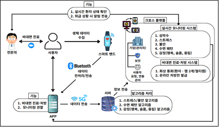

# 시스템 구성도 및 데이터 흐름

---

## 시스템 구성

웨어러블 스마트밴드 기반 생체신호 수집 → 데이터 전처리 후 전송 및 저장 → 실시간 모니터링 및 비대면 진료·처방까지 연결되는 통합 원격진료 플랫폼을 구축하는 것을 목표로 합니다.

사용자의 생체신호를 모니터링 하여 위험 상황을 조기 인지하고, 전문의와 실시간으로 연계함으로써 의료취약지역 환자 관리 및 국가적 확산 가능성을 높입니다.

---

## 데이터 흐름

### 의료용 스마트밴드

HRV, EDA, ST 등 주요 생체신호를 실시간으로 측정하고 전송할 수 있는 센서 모듈을 내장합니다.

배터리 안정성 및 교체 용이성 확보, 무선통신 기능, 장시간 착용 편의성을 고려한 하드웨어 설계를 진행합니다.

### 모바일 애플리케이션

스마트밴드에서 수집한 데이터를 블루투스 기반으로 수신합니다.

4G/5G 네트워크를 활용하여 서버로 데이터를 송신합니다.

사용자에게 실시간 건강 상태, 진료 내역 등을 직관적으로 제공합니다.

### 데이터 서버 및 분석 시스템

개인별 생체데이터 저장 및 관리 기능을 제공합니다.

이상 징후 탐지를 위한 알고리즘 및 분석 모듈을 탑재합니다.

의료진 및 보호자에게 결과 정보를 공유할 수 있는 인터페이스를 제공합니다.

### 실시간 모니터링 시스템 (의료기관용)

환자 수, 측정 지표, 위험 알람, 진료 내역, 진료 일정 등을 종합적으로 표시하는 대시보드를 제공합니다.

의료진이 원격에서 환자 상태를 확인하고 신속히 대응할 수 있는 환경을 조성합니다.

### 비대면 진료·처방 시스템

온라인 처방전 발급, 환자 관리 및 기록 관리 기능을 포함합니다.
